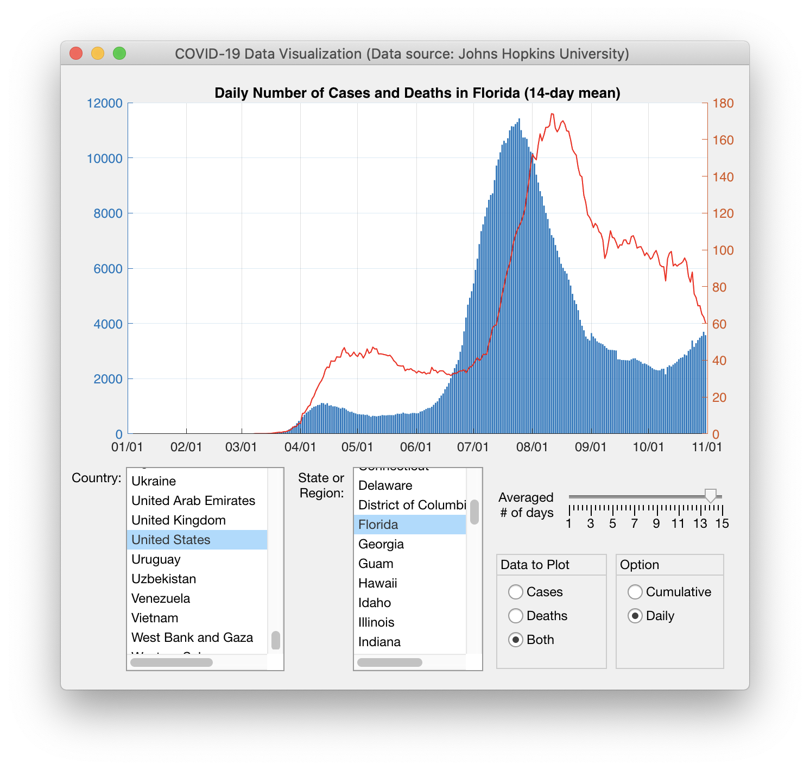

# DOSIFICACIÓN DE MATERIALES 
> Proyecto Final - OCT. 2022 - FEB. 2023

## Objetivos de aprendizaje
- Aplicar nuevas habilidades a un problema del mundo real
- Sintetizar las técnicas aprendidas
- Uso de funciones y módulos, Operaciones con arreglos y matrices
- Gráficas lineales, histogramas o de dispersión 

## Herramientas
> TODO: Listar las librerías y herramientas adicionales que fueron utilizadas.
 
- git
- github 
- python 3 
- librerías (numpy, pandas, matplotlib, etc.)
  

## Organización de carpetas
> TODO: Actualizar

```
├── main.ipynb              # Archivo principal
├── src                     # Archivos fuentes
│   ├── matematicas.py      # Modulo de ejemplo
│   ├── ...                 # 
│   └── ...                 # 
├── data                    # Datos (opcional)
│   ├── covid.csv           # Datos de covid
│   ├── puentes.csv         # Datos de puentes
│   └──                     # ...
└── ...
```


## Descripción
> Este problema de programación es útil para la ingeniería civil para el cálculo de la cantidad de concreto necesaria para construir una estructura. Para este ejemplo, consideraremos una losa de concreto.
El programa solicitará al usuario el largo y ancho de la losa en metros y el espesor de la losa en centímetros. A continuación, calculará la cantidad de concreto necesaria en metros cúbicos y se imprimirá el resultado. Además, el programa contará la cantidad de bolsas de cemento y la cantidad de metros cúbicos de arena y grava necesarios, tomando en cuenta varios datos de docifiacion de materiales.
El problema presentado, se utiliza el lenguaje de programación Python para calcular la cantidad de concreto necesaria para una losa de concreto. Se emplea el uso de funciones y módulos para estructurar el código y facilitar su reutilización.


A continuación se muestra la ventana principal de la aplicación. 


> TODO: Actualizar imagen de prototipo

<div align="center">

</div>


> TODO: Actualizar captura y enlace  a video en youtube
<div align="center">
<a href="http://purl.org/matlabintermedio/proyectofinal/demostracion" target="_blank">

</a>
<p>Demostración de funcionamiento</p>
</div>

<br/><br/>